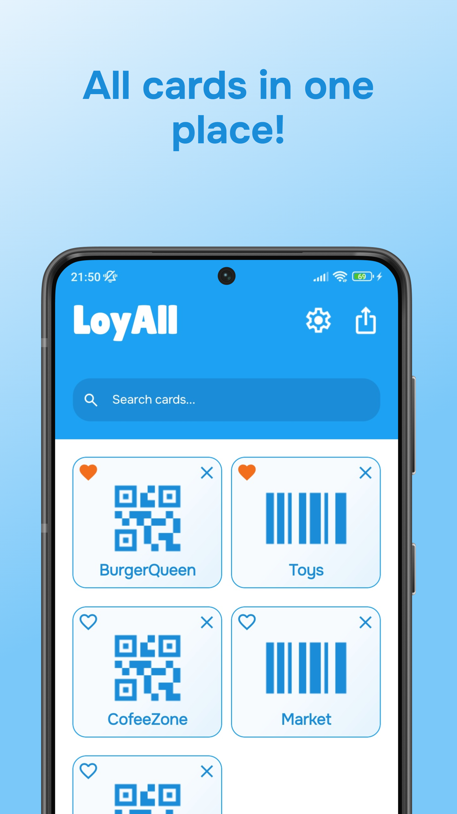
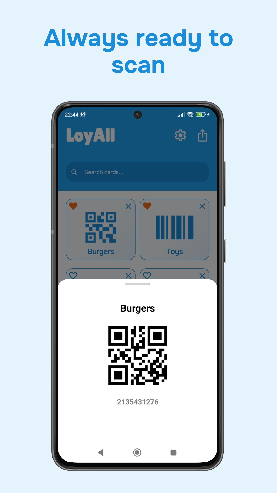
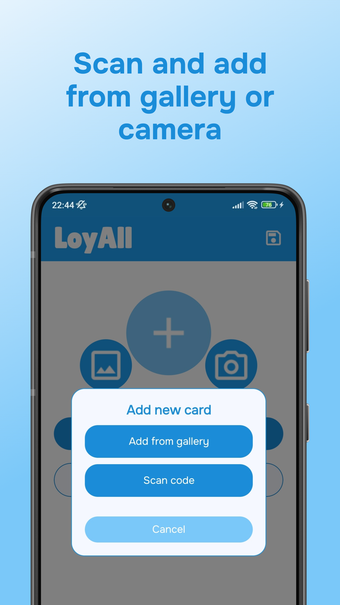
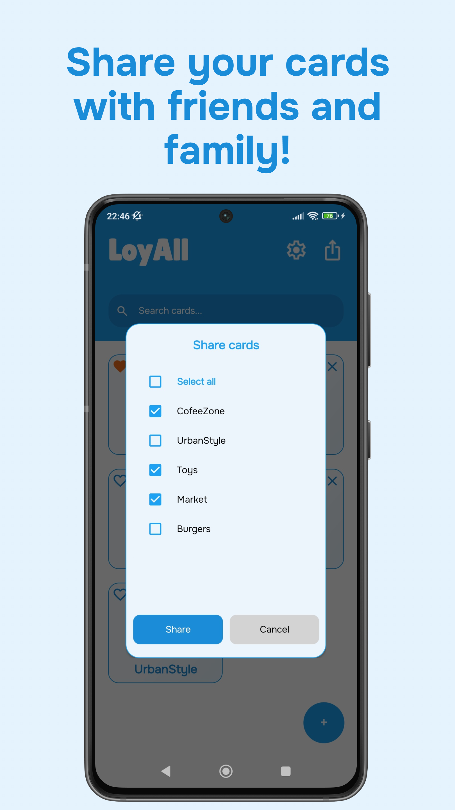
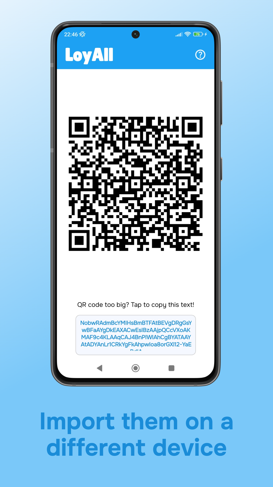

# LoyAll - Loyalty Cards  

  

Turn a phone full of loyalty card apps into **one convenient place**—LoyAll is a simple, fast, and privacy-focused way to manage all your loyalty cards.  
## 📥 Download  
[)](https://play.google.com/store/apps/details?id=com.companyname.loyall)
---
**LoyAll is currently in testing phase.**  
If you’d like to become a tester, feel free to [contact me via email](mailto:murraya.solutions@interia.com)!
## 🖼️ Screenshots

  
  
  

 

  
  

## ✨ Key Features  

### 📲 **Add Cards Easily**  
- Scan from **gallery** or **camera**  
- Supports **QR codes**, **barcodes**, **PDF417**  and **more**

### 📂 **All Cards in One Place**  
- Organized collection, always ready for in-store use  

### 🔗 **Share & Import Cards**  
- Export cards as encoded **QR codes** or **text**  
- Instantly share with friends & family  

## 🛠 Built With  
- **.NET MAUI** – Cross-platform framework  
- **ZXing.Net** – Barcode/QR scanning  

## 🤝 Contribute  
Found a bug or have a feature request? Open an **Issue** or submit a **Pull Request**!  

## 📌 What’s New  
- ✅ **Added support for PDF417 codes** – Scan even more loyalty card types.  
- 🏠 **Clickable logo** – Tap to quickly return to the home screen.  
- 🌍 **New language support** – Use LoyAll in your preferred language.)
